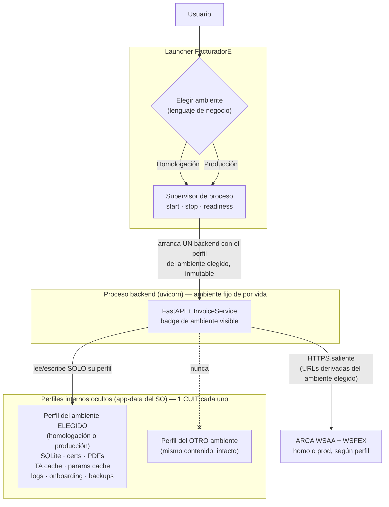
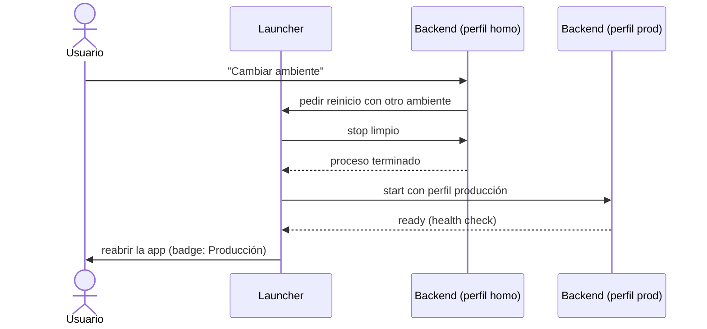

# ADR 0001 — Perfiles de ambiente aislados, seleccionados por el launcher

- **Estado:** aceptada (2026-07-10).
- **Origen:** [FAC-22](https://linear.app/ftripelhorn/issue/FAC-22/adr-adopt-launcher-selected-isolated-environment-profiles),
  proyecto *Seamless Environment Profiles*.
- **Autoridad:** este documento es **la fuente autoritativa** del contrato de
  ambientes/perfiles. Si otro documento (README, `docs/design.md`, guías de
  setup, diagramas de agentes) lo contradice, vale este ADR; la corrección del
  resto de la documentación se hace al implementar
  ([FAC-34](https://linear.app/ftripelhorn/issue/FAC-34/update-product-and-agent-docs-for-isolated-environment-profiles)).

## Contexto

Hasta esta decisión, el ambiente (homologación / producción) se elegía por
**configuración compartida**: un único `FACTURADOR_HOME` con una sola base
SQLite, ambos pares de certificados conviviendo en el mismo `secrets/`, y el
flag `ARCA_ENV` en `<home>/.env` como selector al arrancar. El modelo
multi-emisor llegó además a tratar el ambiente como atributo elegible por
emisor dentro de la misma base (`emisores.ambiente`,
`active_emisor_id_<ambiente>`), y se consideró permitir el cambio de ambiente
**en proceso** (hot switching).

Ese camino acumula riesgo exactamente donde menos se tolera: cruces
homologación/producción de datos, caches (TA del WSAA, tablas de parámetros),
PDFs, numeración y backups, más la complejidad de invalidar todo eso de forma
consistente dentro de un proceso vivo. La separación física elimina esas
clases de error de raíz, en línea con el principio ya vigente de derivar URLs
y certificados de un único flag (checklist §2.1.1 punto 1 de
[`design.md`](../design.md)).

## Decisión

Una sola app ("FacturadorE") con **un launcher** que ofrece dos opciones en
lenguaje de negocio: **Homologación** y **Producción**. Cada opción mapea a un
**perfil interno oculto** que el usuario nunca administra directamente.

**Invariante central:**

> Un proceso backend corre contra **exactamente un ambiente inmutable y un
> perfil**. Cambiar de ambiente significa **parar el backend actual y
> arrancar otro**. No existe hot switching.

Reglas que componen el contrato:

1. El launcher expone Homologación y Producción como elecciones de negocio;
   no expone perfiles, directorios, Docker ni variables de entorno.
2. Cada ambiente mapea a un perfil interno oculto (resuelto desde el
   directorio de datos de aplicación del sistema operativo).
3. Un proceso backend = un ambiente inmutable + un perfil, fijados antes de
   construir FastAPI, SQLite y los clientes ARCA.
4. Cambiar de ambiente **detiene** el backend actual y **arranca** uno nuevo
   (switching por reinicio, orquestado por el launcher).
5. **Rechazado explícitamente:** hot switching de clientes ARCA,
   certificados, base de datos o ambiente dentro de un backend corriendo.
6. Cada perfil es dueño exclusivo de: su base SQLite, sus certificados, su
   cache de PDFs, su cache de TA del WSAA, su cache de parámetros de ARCA,
   sus logs, su estado de onboarding y sus backups.
7. **Un CUIT fiscal por perfil** (el del certificado del perfil).
8. El ambiente activo queda **siempre visible** en la app (badge persistente,
   título, health/diagnóstico).

## Alternativas rechazadas

- **Hot switching en proceso.** Cambiar `ARCA_ENV`, certificados, clientes
  ARCA o conexión a la DB dentro de un backend vivo exige invalidar de forma
  atómica TA cache, cache de parámetros, numeración, PDFs y estado de UI; un
  solo olvido cruza homologación con producción. Rechazado: el costo de un
  reinicio es irrelevante para ~1 factura/semana y elimina la clase de error
  completa.
- **Ambiente por configuración compartida** (`ARCA_ENV` en `.env` + un
  `secrets/` con ambos pares). Es el modelo actual: funciona, pero mantiene
  ambos mundos en el mismo home y convierte la edición manual de un archivo
  en el mecanismo de cambio. Superado por este ADR.
- **Ambiente como atributo por emisor dentro de una única DB.** Mezcla filas
  de homologación y producción en las mismas tablas y obliga a filtrar por
  ambiente en cada consulta. Superado: la DB pasa a ser local al perfil;
  `invoices.environment` se conserva solo como dato de auditoría inmutable,
  validado contra el perfil corriente.

## Diagrama runtime / perfiles

Cambio de ambiente (siempre por reinicio):

## Implicaciones de migración (modelo shared-home actual)

Lo implementado hoy — que las guías de setup siguen describiendo hasta que el
proyecto se ejecute — es: un único `FACTURADOR_HOME` (default `~/facturador`)
con `.env` (`ARCA_ENV`) como selector, ambos certificados en `secrets/`, una
sola DB con `emisores.ambiente` y `active_emisor_id_<ambiente>`, TA cache
`data/ta-wsfex-<env>.json`, y `data/pdfs/`, logs y `backups/` compartidos.
Consecuencias del pasaje al modelo de perfiles:

- **Raíces por perfil, no un home compartido.** Los perfiles se resuelven
  internamente desde el app-data del SO
  ([FAC-23](https://linear.app/ftripelhorn/issue/FAC-23/introduce-environmentprofile-and-profilepaths-abstractions));
  el usuario deja de conocer/gestionar el layout.
- **`ARCA_ENV` en `.env` deja de ser el selector.** El ambiente se inyecta
  una sola vez al construir la app
  ([FAC-24](https://linear.app/ftripelhorn/issue/FAC-24/boot-the-backend-from-one-explicit-environment-profile));
  las URLs de ARCA y los paths derivan de ese perfil.
- **Todo archivo de runtime pasa por `ProfilePaths`** (DB, certs, PDFs, TA,
  params, logs, staging de backups, onboarding)
  ([FAC-25](https://linear.app/ftripelhorn/issue/FAC-25/route-all-profile-owned-runtime-files-through-profilepaths));
  desaparecen los sufijos `<env>` en nombres de archivo dentro de un mismo
  directorio.
- **El estado de emisor se vuelve local al perfil**:
  `active_emisor_id_<ambiente>` se reemplaza por una única clave del perfil, y
  el ambiente sale de los formularios/API de emisor
  ([FAC-26](https://linear.app/ftripelhorn/issue/FAC-26/bind-emisor-state-to-the-selected-profile),
  [FAC-27](https://linear.app/ftripelhorn/issue/FAC-27/remove-environment-selection-from-emisor-api-and-ui)).
  `invoices.environment` se mantiene como auditoría inmutable y se valida
  contra el perfil corriente.
- **Los datos existentes del home compartido corresponden al perfil de su
  ambiente** (`ARCA_ENV` vigente al crearlos). La mecánica concreta de mover
  ese estado a los nuevos perfiles se define en los issues de implementación;
  este ADR no incluye migración de esquema (no-goal).
- **Backups por perfil.** El tarball cifrado pasa a cubrir el estado de un
  perfil, no un home mixto.
- **Nuevas obligaciones del launcher:** supervisión de proceso y readiness
  ([FAC-28](https://linear.app/ftripelhorn/issue/FAC-28/add-launcher-process-supervisor)),
  chooser ([FAC-29](https://linear.app/ftripelhorn/issue/FAC-29/add-launcher-environment-chooser)),
  lock contra instancias duplicadas sobre el mismo perfil
  ([FAC-30](https://linear.app/ftripelhorn/issue/FAC-30/prevent-duplicate-launcher-and-backend-instances)),
  y flujo "Cambiar ambiente" por reinicio
  ([FAC-32](https://linear.app/ftripelhorn/issue/FAC-32/add-restart-based-change-environment-flow)).
- **Identidad de ambiente en la app**
  ([FAC-31](https://linear.app/ftripelhorn/issue/FAC-31/show-persistent-environment-identity-inside-the-app))
  y **tests de aislamiento entre perfiles**
  ([FAC-33](https://linear.app/ftripelhorn/issue/FAC-33/add-profile-isolation-integration-tests)).

Lo que **no cambia**: localhost-only, secretos fuera del repo con permisos
`400/600`, ARCA como autoridad de numeración, un solo proceso sin workers, y
backups cifrados del lado del cliente.

## Consecuencias

- Positivas: imposibilidad estructural de cruzar homologación y producción;
  el usuario piensa en "Homologación / Producción", no en perfiles, `.env` ni
  Docker; el arranque del backend se simplifica (un perfil explícito e
  inmutable en vez de estado seleccionable).
- Costos aceptados: cambiar de ambiente requiere reinicio (segundos, para un
  uso de ~1 factura/semana); el launcher asume responsabilidades nuevas
  (supervisión, locking, readiness); hay una migración documental y de código
  por delante (issues FAC-23 … FAC-34).
