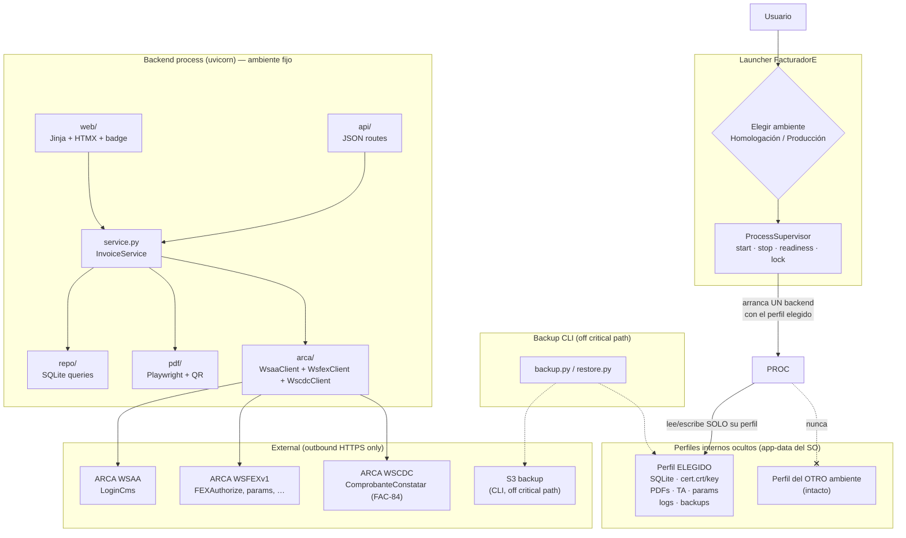
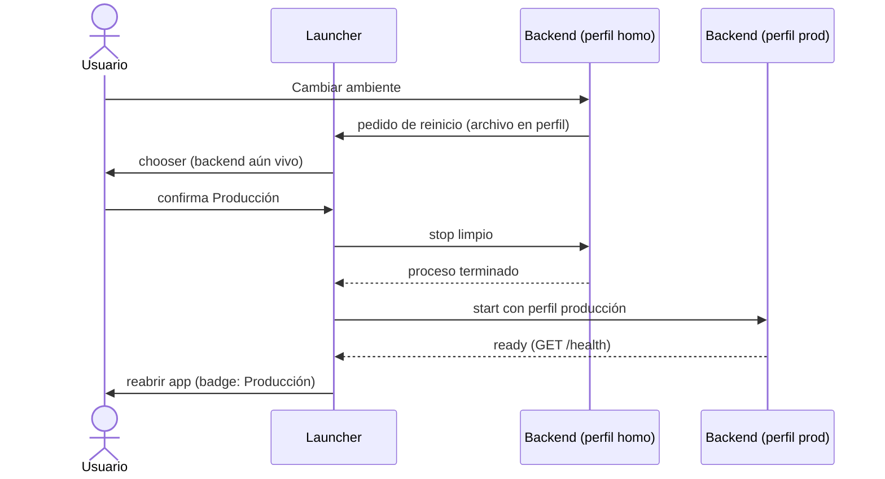
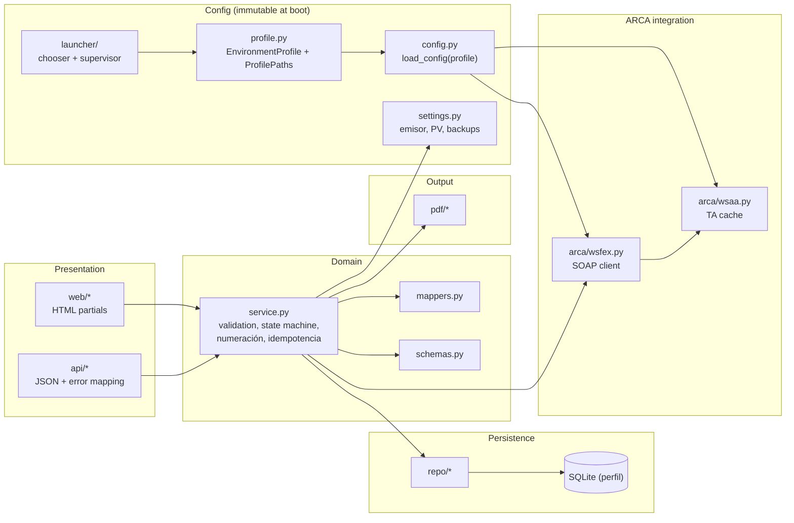
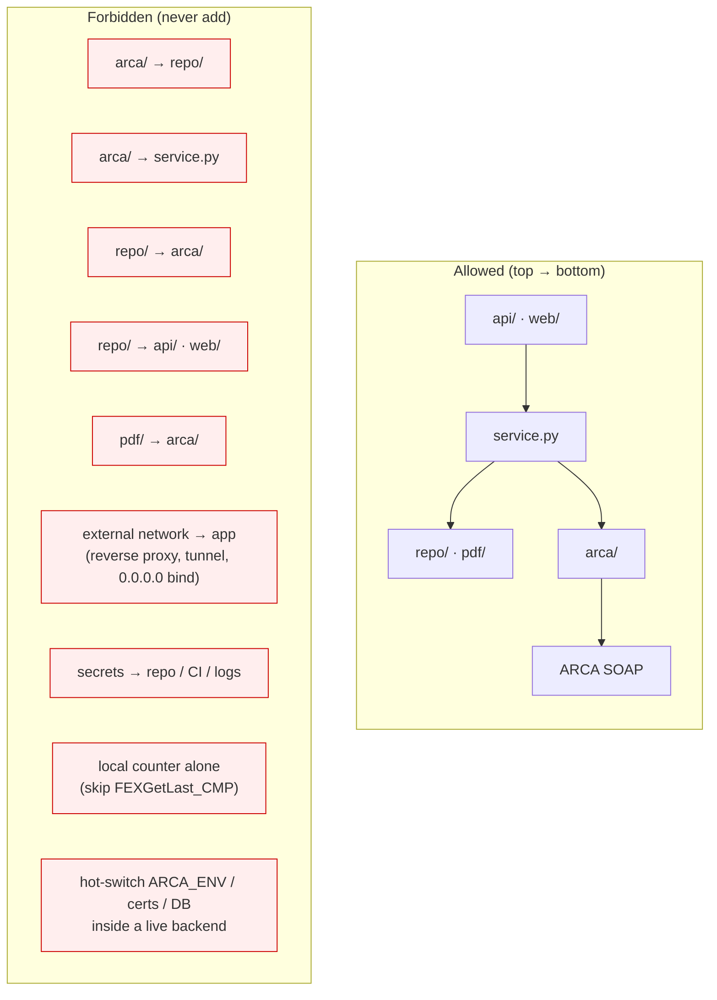
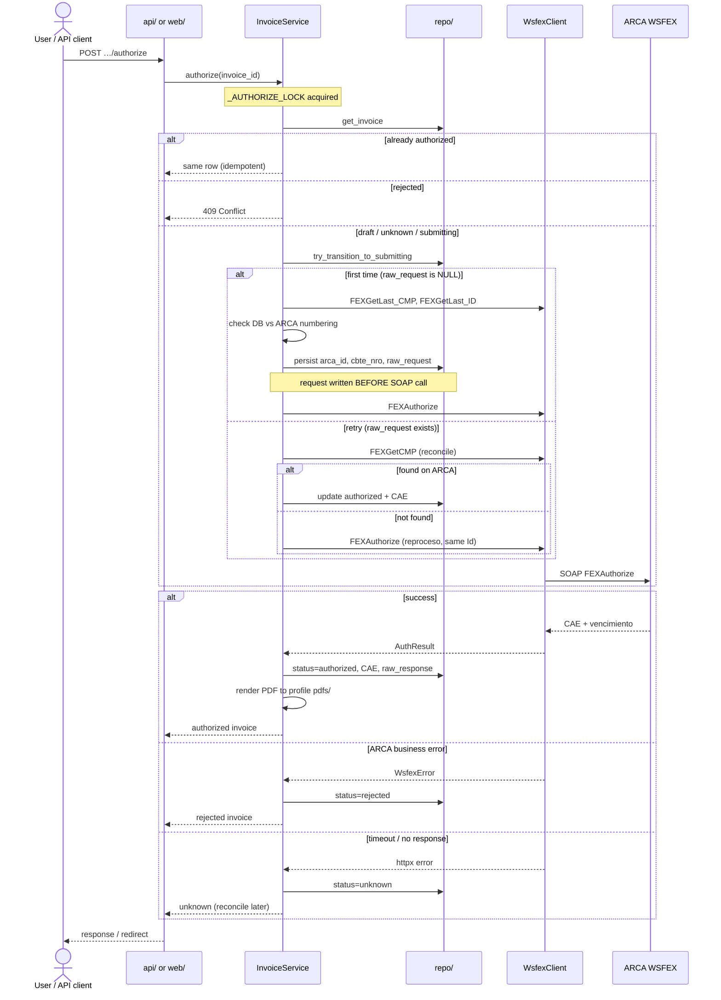
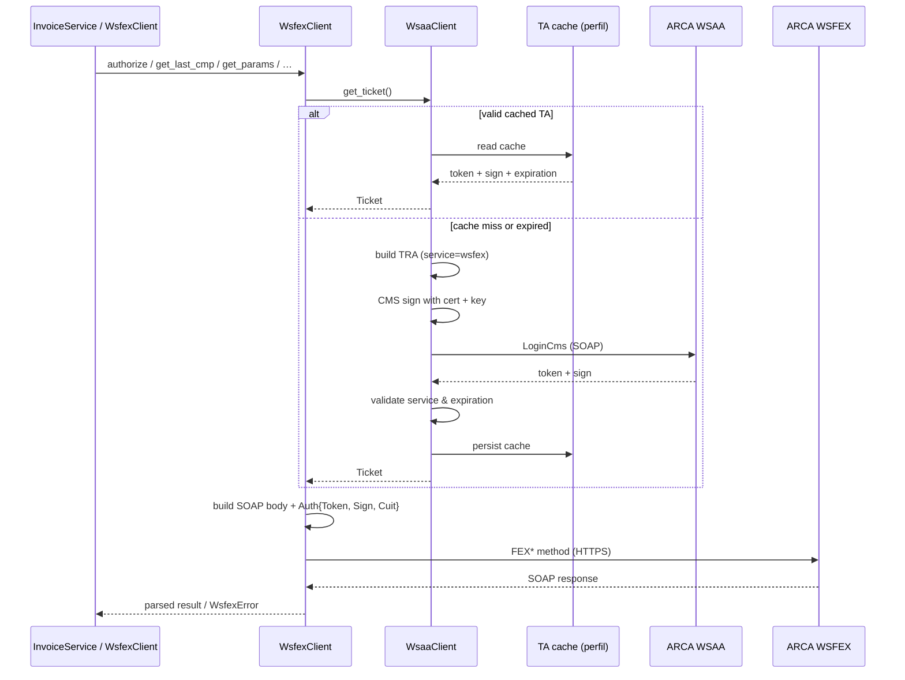
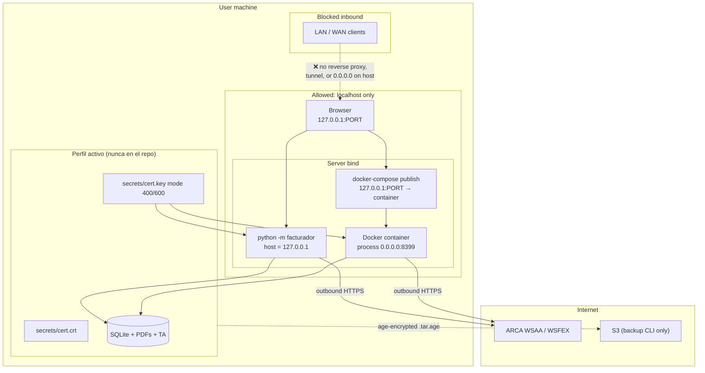

# Architecture graphs (agents)

Curated Mermaid diagrams for **orientation and architectural intent**. They are
**navigation aids only** — not a substitute for reading the code.

**Authoritative sources:** implementation under `facturador/`, tests under
`tests/`, [`docs/design.md`](../design.md), and
[`docs/adr/0001-perfiles-de-ambiente-aislados.md`](../adr/0001-perfiles-de-ambiente-aislados.md)
(environment/profile contract). When a diagram disagrees with those, trust the
code, design doc, and ADR.

For file-level navigation, see [`repo-map.md`](repo-map.md). For commands and
constraints, see [`AGENTS.md`](../../AGENTS.md). For verification scopes by task,
see [`verification-matrix.md`](verification-matrix.md).

---

## Runtime architecture

One FacturadorE launcher, two hidden profiles (Homologación / Producción), one
immutable environment per backend process. Single-process FastAPI: JSON API +
Jinja/HTMX UI, SQLite, outbound SOAP to ARCA. No workers, queues, or external
database. Changing environment restarts the backend (no hot switching).

Cambio de ambiente (siempre por reinicio):

---

## Intentional boundaries

Layers are separated so domain rules and ARCA integration stay testable and
isolated from HTTP concerns.

**Boundary rules:**

| Layer | Responsibility | Must not |
|---|---|---|
| `api/` / `web/` | HTTP, routing, thin handlers | Domain validation, SOAP, SQL |
| `service.py` | Business rules, authorize flow | Raw XML, template rendering |
| `repo/` | SQLite CRUD | ARCA calls, HTTP |
| `arca/` | WSAA/WSFEX SOAP | Invoice state machine |
| `pdf/` | HTML → PDF, QR payload | ARCA or DB writes |
| `launcher/` | Choose env, supervise one profile | Mutate ARCA clients in a live backend |
| `profile.py` | Resolve isolated roots / paths | Expose profile paths in normal UI |

---

## Forbidden dependency directions

These directions are **intentionally blocked**. Adding them is an architecture
regression unless `docs/design.md` is updated first.

**Quick checks before merging:**

- `arca/` imports only `config`, `constants`, and sibling `wsaa`/`wsfex` — no `repo` or `service`.
- `repo/` has no `httpx`, no `arca` imports.
- `pdf/` receives already-authorized data; it does not call WSFEX.
- Uvicorn binds `127.0.0.1` on the host; Docker publishes `127.0.0.1:PORT` only.
- Environment is fixed at boot from `EnvironmentProfile`; no in-process ARCA/env swap.

---

## Invoice authorization sequence

Happy path and recovery branches for `POST /invoices/:id/authorize` (rules in
`docs/design.md` §2.3). All authorize calls are serialized (`_AUTHORIZE_LOCK`).

---

## WSAA / WSFEX auth flow

Every WSFEX call needs a valid Ticket de Acceso (TA). WSAA is called only when
the cached TA is missing or near expiry.

**Notes:**

- The boot `EnvironmentProfile` derives both WSAA and WSFEX URLs and cert paths
  atomically — never mix environments; never hot-switch mid-process.
- Token, sign, and CMS payloads are redacted in logs (credentials).
- Clock skew breaks WSAA; NTP is required on the host.

---

## Localhost security model

The app is a **local desktop tool**, not a network service. The only outbound
connections are to ARCA (and optional S3 backup via CLI).

**Do not add without a design change:**

- Uvicorn `0.0.0.0` on the bare host
- Reverse proxies, Tailscale/WireGuard exposure, or auth layers to reach the app
  from another machine
- Cert/key pairs in the repo, CI, or logs
- In-process hot switching of `ARCA_ENV`, certificates, or database
- Permissive CORS / `Access-Control-Allow-Origin: *`
- Accepting non-loopback `Host` or cross-origin `Origin`/`Referer` on
  state-changing requests (see `facturador/api/localhost_policy.py`, FAC-41)

**Allowed loopback forms** (ports = listen ∪ optional Docker public port):

| Header | Allowed values |
|--------|----------------|
| `Host` | `127.0.0.1:<port>`, `localhost:<port>`, `[::1]:<port>` |
| `Origin` (unsafe methods) | `http://127.0.0.1:<port>`, `http://localhost:<port>`, `http://[::1]:<port>` |

- Native / launcher: one port (`FACTURADOR_PORT`).
- Docker: container listens on 8399; host publish may differ
  (`127.0.0.1:${FACTURADOR_PORT}:8399`). Compose sets `FACTURADOR_PUBLIC_PORT`
  to the host-side port so both internal healthchecks and the browser Host
  are accepted.

Unexpected `Host` → 400. Unexpected `Origin`/`Referer` on POST/PUT/PATCH/DELETE → 403.
Missing Origin/Referer on unsafe methods remains allowed for non-browser
clients (API / launcher health). Browser form POSTs under `/ui/` additionally
require a CSRF double-submit token (FAC-42, `facturador/api/csrf.py`): cookie
`facturador_csrf` + form field `csrf_token` (or `X-CSRF-Token` header).
Missing/invalid CSRF → 403. Token material is never logged or echoed.

**Future multi-machine use** (documented in `docs/design.md` §2.5): restore
encrypted backup on a secondary machine; still localhost-only on that machine.
Never run two instances emitting in parallel.

---

## Related reading

- [`repo-map.md`](repo-map.md) — where code lives by task type
- [`docs/design.md`](../design.md) — authoritative architecture and domain rules
- [`docs/adr/0001-perfiles-de-ambiente-aislados.md`](../adr/0001-perfiles-de-ambiente-aislados.md)
  — authoritative environment/profile contract (launcher-selected isolated profiles)
- [`AGENTS.md`](../../AGENTS.md) — agent contract, commands, security rules
