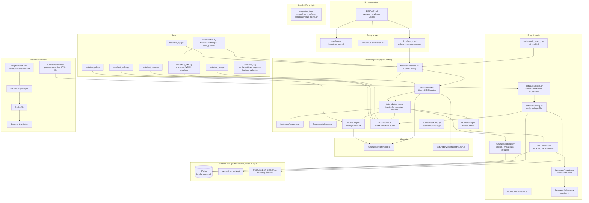

# Repository map (agents)

Curated navigation for **facturador**. Read this before broad `grep`/glob searches.
For commands and constraints, see [`AGENTS.md`](../../AGENTS.md). For which checks
to run by task type, see [`verification-matrix.md`](verification-matrix.md).

## High-level layout

**Data flow (happy path):** UI or JSON API → `InvoiceService` → `repo/` (SQLite) ↔ `arca/wsfex` (SOAP) → PDF on authorize.

**Environments:** one launcher, two hidden profiles (Homologación / Producción), one immutable environment per backend process ([ADR 0001](../adr/0001-perfiles-de-ambiente-aislados.md)).

## Start here by task type

### API / routes

| What | Where |
|------|-------|
| App assembly, error mapping, router registration | `facturador/api/app.py` |
| Localhost Host/Origin policy (FAC-41) | `facturador/api/localhost_policy.py` |
| CSRF for browser forms (FAC-42) | `facturador/api/csrf.py`, `facturador/web/templates/_csrf_field.html` |
| Production first-use confirmation (FAC-40) | `facturador/production_ack.py`, `facturador/launcher/production_ack.py`, launcher `__main__.py` |

| Per-profile setup state + guard (FAC-35) | `facturador/setup.py` (incl. `make_setup_state_provider`), `facturador/api/setup_guard.py`, `facturador/api/setup.py` |
| Shared `InvoiceService` dependency | `facturador/api/deps.py` |
| REST: invoices (create, authorize, list, PDF) | `facturador/api/invoices.py` |
| REST: clients CRUD | `facturador/api/clients.py` |
| REST: ARCA param tables & cotización | `facturador/api/params.py` |
| REST: health + ARCA connectivity | `facturador/api/health.py` |
| REST: setup status (`GET /setup`) | `facturador/api/setup.py` |
| Request/response Pydantic models | `facturador/schemas.py` |
| Domain logic, state machine, authorize lock | `facturador/service.py` |
| Row ↔ WSFEX `Invoice` mapping | `facturador/mappers.py` |
| Contract tests | `tests/test_api.py`, `tests/test_authorize.py` |
| Host/Origin policy | `tests/test_localhost_policy.py` |
| CSRF forms | `tests/test_csrf.py`, `tests/test_web.py` |
| Setup state / onboarding guard | `tests/test_setup.py` |

OpenAPI is served by FastAPI at `/docs` when the app is running.

### ARCA behavior

| What | Where |
|------|-------|
| WSAA: TRA, CMS sign, TA cache | `facturador/arca/wsaa.py` |
| WSFEX: SOAP build/parse, `FEXAuthorize`, params | `facturador/arca/wsfex.py` |
| Environment URLs (`homo` / `prod`) | `facturador/constants.py` (`WSAA_URLS`, `WSFEX_URLS`) |
| Profile roots & runtime paths | `facturador/profile.py` (`EnvironmentProfile`, `ProfilePaths`) |
| Boot: inject one environment, validate certs | `facturador/config.py` (`resolve_boot_profile`, `load_config`) |
| Domain rules & checklist | `docs/design.md` §1–2 |
| In-process fake (no network) | `tests/arca_fake.py` |
| WSAA unit tests | `tests/test_wsaa.py` |
| WSFEX unit tests | `tests/test_wsfex.py` |
| Manual homologación checks (local only) | `scripts/get_ta.py`, `scripts/check_wsfex.py`, `scripts/authorize_homo.py` |

`InvoiceService.authorize()` serializes concurrent calls (`_AUTHORIZE_LOCK` in `service.py`) because ARCA numbering is strictly sequential.

### UI / HTMX

| What | Where |
|------|-------|
| All HTML routes (thin handlers) | `facturador/web/routes.py` |
| Page templates | `facturador/web/templates/` |
| HTMX (vendored, no CDN) | `facturador/web/static/htmx.min.js` |
| Invoice flow partials | `_datos_factura.html`, `revisar.html`, `detalle.html` |
| Clients page | `clients.html` |
| Settings page | `configuracion.html` |
| Invoice list | `comprobantes.html`, `_listado.html` |
| Base layout | `base.html`, `home.html` |
| Frontend tests | `tests/test_web.py` |

UI routes use the prefix `/ui/…` for mutating POSTs (Post/Redirect/Get). Domain errors render in partials, not via the JSON exception handlers in `api/app.py`.

### PDF

| What | Where |
|------|-------|
| HTML → PDF (WeasyPrint) + cache helper | `facturador/pdf/render.py` |
| Versioned renderer registry (FAC-53) | `facturador/pdf/registry.py` |
| QR payload (RG 4892) | `facturador/pdf/qr.py` |
| Print layout template (v1) | `facturador/pdf/invoice.html` |
| PDF download route (API) | `facturador/api/invoices.py` (`GET …/pdf`) |
| Layout spec & field mapping | `docs/design.md` §0.1 |
| PDF tests | `tests/test_pdf.py` |

Generated PDFs are an optional local cache under the active profile's
`data/pdfs/` (`ProfilePaths.pdf_dir`). Missing cache regenerates from the
invoice snapshot via the renderer selected by `pdf_render_version`; normal
backups exclude `data/pdfs/` (FAC-53).

### Emisor entity / multi-emisor (FAC-8 area)

Use this section for work on **alta de emisores** (each emisor with its own
puntos de venta). Emisores are **local to the active profile** (ADR 0001 /
FAC-26): the DB belongs to one environment, so there is no per-emisor
environment selector in the API/UI (FAC-27). Do not grep the whole tree — the
split between `emisores` and global backup `settings` is easy to miss.

| What | Where |
|------|-------|
| `Emisor` dataclass, load/save orchestration | `facturador/settings.py` |
| SQLite `emisores` table (CRUD; `ambiente` seal only) | `facturador/repo/emisores.py` |
| Active emisor (`active_emisor_id` in settings) | `facturador/settings.py`, `facturador/repo/settings.py` |
| Global backup bucket/prefix (`settings` table) | `facturador/repo/settings.py` |
| Schema (`emisores`, `settings`) | `facturador/schema.sql` (baseline v1) |
| Schema migrations + FK pragma | `facturador/migrations/`, `facturador/db.py` |
| Migration / integrity tests | `tests/test_migrations.py` |
| Config UI | `facturador/web/routes.py`, `configuracion.html` |
| Runtime emisor resolution | `facturador/service.py` / `load_settings(conn)` |
| Tests | `tests/test_settings.py` |

**Current behavior (not a bug):**

- The schema allows **several emisores per profile**; runtime uses the explicit
  **active** emisor (`active_emisor_id`). Without a selection there is no
  operative emisor.
- `/configuracion` manages emisores in the **current profile only**; environment
  is read-only context (badge / profile), not a form field.
- Invoicing uses the **first** value in `puntos_venta` (`Emisor.punto_venta`).
- S3 backup config is **global to the profile** (not per emisor).

**FAC-8 scope (still open):** richer UI to register multiple emisores and choose
which one operates; PV selection when more than one is enabled. See
[`known-non-bugs.md`](known-non-bugs.md) § Multi-emisor schema vs selection UI.

### Config / Docker / launchers / secrets

| What | Where |
|------|-------|
| Profile roots & all runtime paths | `facturador/profile.py` |
| Boot config from one profile | `facturador/config.py` |
| Optional bootstrap `.env` | `<FACTURADOR_HOME>/.env` (port / explicit `ARCA_ENV` for non-launcher entrypoints) |
| Cert/key pair (manual, gitignored) | Profile `secrets/cert.{crt,key}` via `ProfilePaths` |
| Domain config (emisor, PV, S3 backup) | Profile SQLite `settings` + `emisores` — see § Emisor entity above |
| Constants & ARCA codes | `facturador/constants.py` |
| Docker image & localhost bind | `Dockerfile`, `docker-compose.yml` |
| Container entrypoint (profile normalize + secrets copy) | `docker/entrypoint.sh` |
| Process supervisor + chooser + switch | `facturador/launcher/` |
| Double-click Docker helpers | `scripts/launch.cmd`, `scripts/launch.command` |
| Encrypted backup/restore CLI | `facturador/backup.py`, `facturador/restore.py` |
| Homologación setup walkthrough | `docs/setup-homologacion.md` |
| Production setup walkthrough | `docs/setup-produccion.md` |
| Config / profile tests | `tests/test_config.py`, `tests/test_profile.py`, `tests/test_settings.py` |
| Launcher + isolation tests | `tests/test_launcher.py`, `tests/test_profile_isolation.py` |

Never commit secrets. Key files must stay mode 400/600.

**Launcher supervisor (FAC-28 / FAC-29 / FAC-30 / FAC-32):**
`python -m facturador.launcher` (optionally `--env homo|prod`) shows the
Homologación/Producción chooser unless `--env` is passed, resolves the hidden
profile, takes a per-profile lock (`ProfilePaths.launcher_lock`), starts
`python -m facturador` with that single `ARCA_ENV`, waits for `GET /health`,
opens the browser only when ready, and stops the child on Ctrl+C without
orphaning it. A second launch against the same profile reuses a healthy session
(reopens the browser) or fails with a clear message; stale lock files without a
live flock do not block startup. Startup failures from the chooser return to the
chooser. **Cambiar ambiente** (FAC-32): the UI writes a request file under the
current profile; the launcher shows the chooser while the backend is still
running (cancel keeps it); confirming another environment stops the current
backend before starting the target profile (no in-process hot-switch).

### Tests

| What | Where |
|------|-------|
| Shared fixtures (cert, app, fake ARCA, `seed_params`) | `tests/conftest.py` |
| WSFEX in-process simulator | `tests/arca_fake.py` |
| API contract | `tests/test_api.py` |
| Authorize / state machine | `tests/test_authorize.py` |
| Web / HTMX flows | `tests/test_web.py` |
| WSAA | `tests/test_wsaa.py` |
| WSFEX client | `tests/test_wsfex.py` |
| PDF | `tests/test_pdf.py` |
| Profiles / isolation | `tests/test_profile.py`, `tests/test_profile_isolation.py` |
| Schema migrations / FK integrity | `tests/test_migrations.py` |
| Launcher | `tests/test_launcher.py` |
| Mappers, constants, backup | `tests/test_mappers.py`, `tests/test_constants.py`, `tests/test_backup.py` |

Run from repo root: `uv run pytest`. CI mirrors lint/types/tests in `.github/workflows/ci.yml`.

## Related reading

- [`AGENTS.md`](../../AGENTS.md) — agent contract, commands, security rules
- [`docs/design.md`](../design.md) — authoritative architecture reference
- [`docs/adr/0001-perfiles-de-ambiente-aislados.md`](../adr/0001-perfiles-de-ambiente-aislados.md)
  — environment/profile contract
- [`README.md`](../../README.md) — user-facing overview (one app, two environments)
