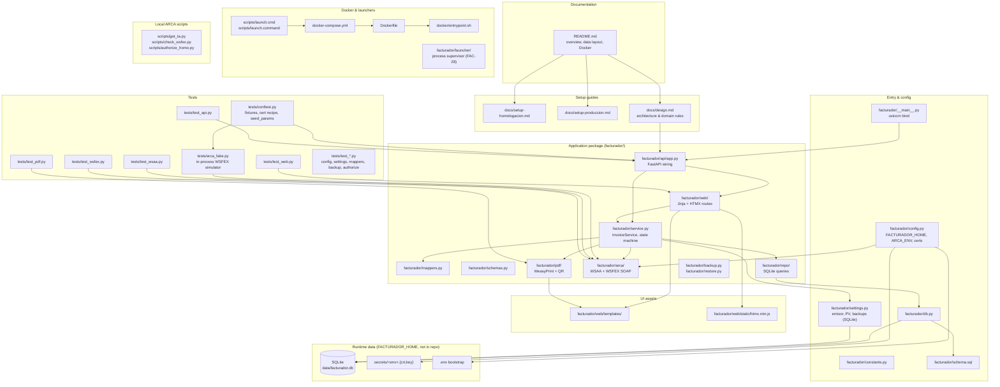

# Repository map (agents)

Curated navigation for **facturador**. Read this before broad `grep`/glob searches.
For commands and constraints, see [`AGENTS.md`](../../AGENTS.md). For which checks
to run by task type, see [`verification-matrix.md`](verification-matrix.md).

## High-level layout

**Data flow (happy path):** UI or JSON API → `InvoiceService` → `repo/` (SQLite) ↔ `arca/wsfex` (SOAP) → PDF on authorize.

## Start here by task type

### API / routes

| What | Where |
|------|-------|
| App assembly, error mapping, router registration | `facturador/api/app.py` |
| Shared `InvoiceService` dependency | `facturador/api/deps.py` |
| REST: invoices (create, authorize, list, PDF) | `facturador/api/invoices.py` |
| REST: clients CRUD | `facturador/api/clients.py` |
| REST: ARCA param tables & cotización | `facturador/api/params.py` |
| REST: health + ARCA connectivity | `facturador/api/health.py` |
| Request/response Pydantic models | `facturador/schemas.py` |
| Domain logic, state machine, authorize lock | `facturador/service.py` |
| Row ↔ WSFEX `Invoice` mapping | `facturador/mappers.py` |
| Contract tests | `tests/test_api.py`, `tests/test_authorize.py` |

OpenAPI is served by FastAPI at `/docs` when the app is running.

### ARCA behavior

| What | Where |
|------|-------|
| WSAA: TRA, CMS sign, TA cache | `facturador/arca/wsaa.py` |
| WSFEX: SOAP build/parse, `FEXAuthorize`, params | `facturador/arca/wsfex.py` |
| Environment URLs (`homo` / `prod`) | `facturador/constants.py` (`WSAA_URLS`, `WSFEX_URLS`) |
| Startup cert/env consistency | `facturador/config.py` |
| Domain rules & checklist | `docs/design.md` §1–2 |
| In-process fake (no network) | `tests/arca_fake.py` |
| WSAA unit tests | `tests/test_wsaa.py` |
| WSFEX unit tests | `tests/test_wsfex.py` |
| Manual homologación checks (local only) | `scripts/get_ta.py`, `scripts/check_wsfex.py`, `scripts/authorize_homo.py` |

`InvoiceService.authorize()` serializes concurrent calls (`_AUTHORIZE_LOCK` in `service.py`) because ARCA numbering is strictly sequential.

### UI / HTMX

| What | Where |
|------|-------|
| All HTML routes (thin handlers) | `facturador/web/routes.py` |
| Page templates | `facturador/web/templates/` |
| HTMX (vendored, no CDN) | `facturador/web/static/htmx.min.js` |
| Invoice flow partials | `_datos_factura.html`, `revisar.html`, `detalle.html` |
| Clients page | `clients.html` |
| Settings page | `configuracion.html` |
| Invoice list | `comprobantes.html`, `_listado.html` |
| Base layout | `base.html`, `home.html` |
| Frontend tests | `tests/test_web.py` |

UI routes use the prefix `/ui/…` for mutating POSTs (Post/Redirect/Get). Domain errors render in partials, not via the JSON exception handlers in `api/app.py`.

### PDF

| What | Where |
|------|-------|
| HTML → PDF (WeasyPrint) | `facturador/pdf/render.py` |
| QR payload (RG 4892) | `facturador/pdf/qr.py` |
| Print layout template | `facturador/pdf/invoice.html` |
| PDF download route (API) | `facturador/api/invoices.py` (`GET …/pdf`) |
| Layout spec & field mapping | `docs/design.md` §0.1 |
| PDF tests | `tests/test_pdf.py` |

PDFs are written under `<FACTURADOR_HOME>/data/pdfs/` after authorization.

### Emisor entity / multi-emisor (FAC-8 area)

Use this section for work on **alta de emisores** (each emisor with its own
ambiente and puntos de venta). Do not grep the whole tree — the split between
`emisores` (per-entity) and `settings` (global backup key/value) is easy to miss.

| What | Where |
|------|-------|
| `Emisor` dataclass, load/save orchestration | `facturador/settings.py` |
| SQLite `emisores` table (CRUD, oldest-per-ambiente) | `facturador/repo/emisores.py` |
| Global backup bucket/prefix (`settings` table) | `facturador/repo/settings.py` |
| Schema (`emisores`, `settings`) | `facturador/schema.sql` |
| Config UI (single emisor form today) | `facturador/web/routes.py`, `configuracion.html` |
| Runtime emisor resolution | `facturador/service.py` (`load_settings(conn, env)`) |
| Tests | `tests/test_settings.py` |

**Current behavior (not a bug):**

- The schema allows **several emisores per ambiente**; runtime picks the
  **oldest** row for the active `ARCA_ENV` (`get_emisor_por_ambiente`).
- `/configuracion` **upserts one emisor** per ambiente (no alta/lista UI yet).
- Invoicing uses the **first** value in `puntos_venta` (`Emisor.punto_venta`).
- S3 backup config is **global** (not per emisor).

**FAC-8 scope (still open):** UI to register multiple emisores and choose which
one operates; PV selection when more than one is enabled. See
[`known-non-bugs.md`](known-non-bugs.md) § Multi-emisor schema vs selection UI.

### Config / Docker / launchers / secrets

| What | Where |
|------|-------|
| Bootstrap env (`ARCA_ENV`, port) | `<FACTURADOR_HOME>/.env` — read by `facturador/config.py` |
| Cert/key pair (manual, gitignored) | Profile `secrets/cert.{crt,key}` via `ProfilePaths` |
| Domain config (emisor, PV, S3 backup) | SQLite `settings` + `emisores` — see § Emisor entity above |
| Constants & ARCA codes | `facturador/constants.py` |
| Docker image & localhost bind | `Dockerfile`, `docker-compose.yml` |
| Container entrypoint (secrets copy) | `docker/entrypoint.sh` |
| Process supervisor (FAC-28) | `facturador/launcher/` — start/stop one profile-bound backend, readiness, browser |
| Double-click Docker helpers | `scripts/launch.cmd`, `scripts/launch.command` |
| Encrypted backup/restore CLI | `facturador/backup.py`, `facturador/restore.py` |
| Homologación setup walkthrough | `docs/setup-homologacion.md` |
| Production setup walkthrough | `docs/setup-produccion.md` |
| Config tests | `tests/test_config.py`, `tests/test_settings.py` |
| Launcher tests | `tests/test_launcher.py` |

Never commit secrets. Key files must stay mode 400/600.

**Launcher supervisor (FAC-28 / FAC-30):** `python -m facturador.launcher --env homo|prod`
resolves the hidden profile, takes a per-profile lock (`ProfilePaths.launcher_lock`),
starts `python -m facturador` with that single `ARCA_ENV`, waits for `GET /health`,
opens the browser only when ready, and stops the child on Ctrl+C without orphaning
it. A second launch against the same profile reuses a healthy session (reopens the
browser) or fails with a clear message; stale lock files without a live flock do
not block startup (the lock file is kept on disk — flock is the authority). No
chooser UI yet (FAC-29).

### Tests

| What | Where |
|------|-------|
| Shared fixtures (cert, app, fake ARCA, `seed_params`) | `tests/conftest.py` |
| WSFEX in-process simulator | `tests/arca_fake.py` |
| API contract | `tests/test_api.py` |
| Authorize / state machine | `tests/test_authorize.py` |
| Web / HTMX flows | `tests/test_web.py` |
| WSAA | `tests/test_wsaa.py` |
| WSFEX client | `tests/test_wsfex.py` |
| PDF | `tests/test_pdf.py` |
| Mappers, constants, backup | `tests/test_mappers.py`, `tests/test_constants.py`, `tests/test_backup.py` |

Run from repo root: `uv run pytest`. CI mirrors lint/types/tests in `.github/workflows/ci.yml`.

## Related reading

- [`AGENTS.md`](../../AGENTS.md) — agent contract, commands, security rules
- [`docs/design.md`](../design.md) — authoritative architecture reference
- [`README.md`](../../README.md) — user-facing overview and `FACTURADOR_HOME` layout
